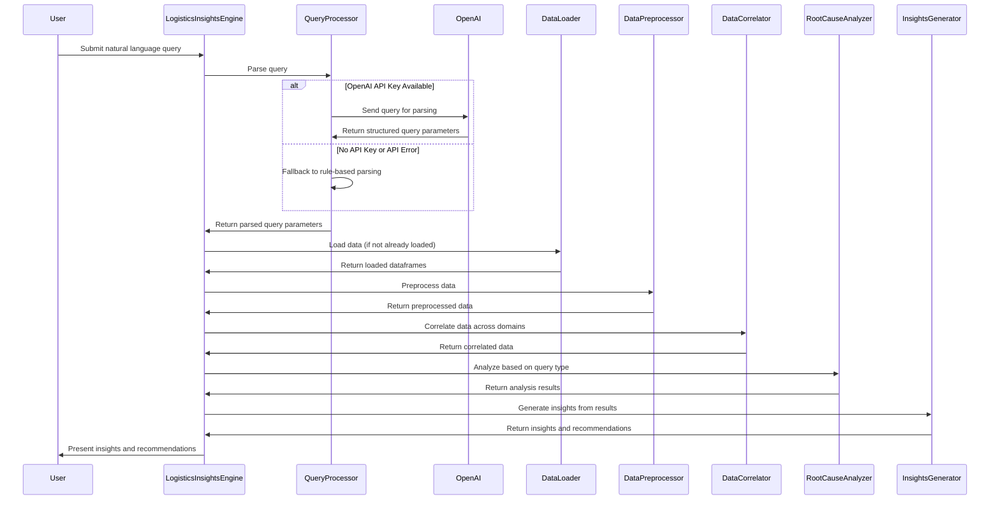

# Order Delivery Analysis System: Approach Document

## Problem Statement

The company faces challenges with disconnected data sources that prevent effective root cause analysis of delivery issues:

1. **Disconnected Data Sources**:
   - Order & shipment data with timestamps but no context
   - Unstructured fleet logs and driver notes
   - Warehouse data not linked to delivery performance
   - Unstructured customer feedback
   - External contextual data (traffic, weather) not integrated

2. **Business Requirements**:
   - Aggregate multi-domain data
   - Automatically correlate events
   - Generate human-readable insights
   - Surface actionable recommendations

## Solution Approach

Our solution implements a comprehensive data analysis pipeline that connects previously siloed data sources, identifies correlations between events, and generates actionable insights. The system follows a modular architecture with the following components:

### 1. Data Loading Layer

The `DataLoader` module handles importing data from various sources:
- Orders and shipments
- Fleet logs and driver notes
- Warehouse data
- Customer feedback
- External factors (traffic, weather, events)

This layer validates data integrity and converts raw data into structured models using a type-safe approach.

### 2. Data Preprocessing Layer

The `DataPreprocessor` module cleans and transforms the raw data:
- Standardizes date formats
- Handles missing values
- Normalizes text fields
- Extracts structured information from unstructured text
- Creates derived metrics and features

### 3. Correlation Engine

The `DataCorrelator` module connects events across different domains:
- Links orders with fleet logs to track delivery journeys
- Associates warehouse processing times with delivery outcomes
- Connects external factors (weather, traffic) to specific deliveries
- Maps customer feedback to specific orders and issues
- Creates a comprehensive view that joins all relevant data points

The correlation engine leverages the following packages:
- **pandas**: For data manipulation and merging related datasets
- **numpy**: For numerical operations and handling missing values
- **datetime**: For time-based correlation and delay calculations

### 4. Root Cause Analysis

The `RootCauseAnalyzer` module identifies patterns and causes of delivery issues:
- Analyzes delivery failures by category and specific reason
- Examines delivery delays and their patterns
- Identifies external factors that impact performance
- Evaluates warehouse processing bottlenecks
- Assesses driver and route performance

### 5. Insights Generation

The `InsightsGenerator` module transforms technical findings into human-readable narratives:
- Generates insights about city performance
- Creates client-specific analysis
- Provides warehouse operational insights
- Compares performance across cities
- Predicts risks for future order volumes
- Produces actionable recommendations

### 6. Query Processing

The `QueryProcessor` module enables natural language interaction:
- Parses natural language queries
- Maps queries to specific analysis types
- Extracts entities, time ranges, and parameters
- Handles calls to OpenAI API with appropriate prompt, User query and context data to OpenAI API

## Sequence Diagram

